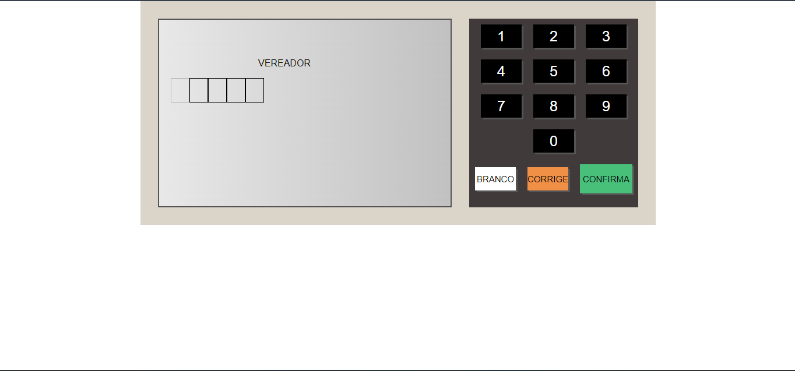
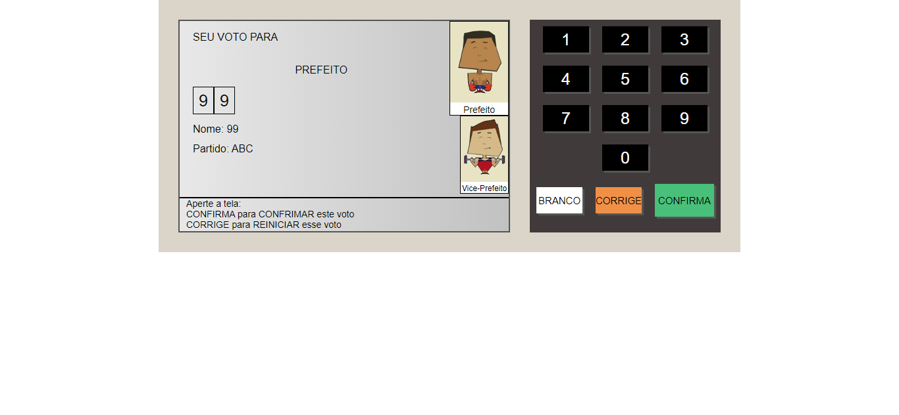
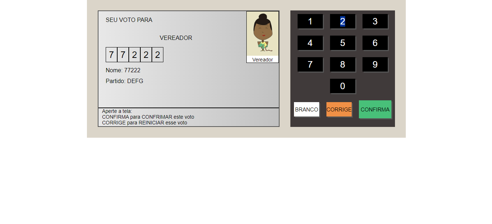
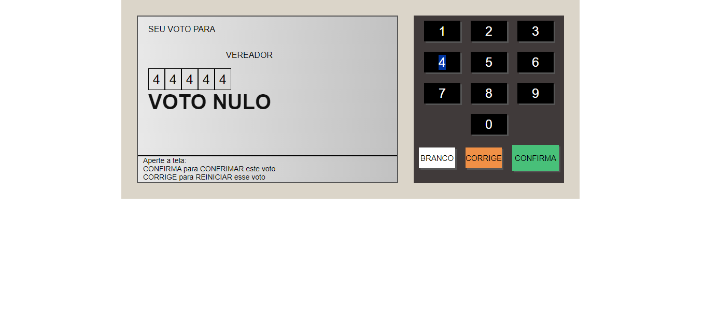
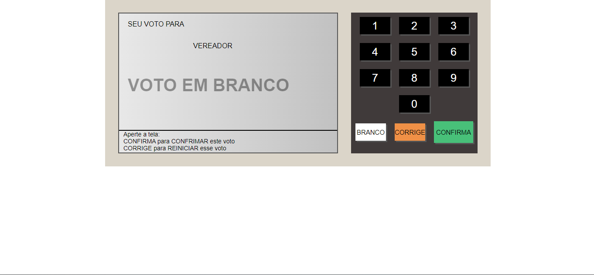

# Urna Eletrônica 

## Descrição

Este projeto é uma simulação de uma **urna eletrônica** desenvolvida em JavaScript, que permite a votação de candidatos em uma interface amigável. O objetivo principal é demonstrar o funcionamento básico de uma votação eletrônica, incluindo a seleção de candidatos, confirmação de voto e contagem final.

## Captura do Projeto
-  Inicio: 
 

-  Voto: 

- Nulo: 

 -  Branco: 

 

## Funcionalidades

-   Interface gráfica para simular uma urna eletrônica.
-   Validação de votos.
-   Exibição dos votos registrados no console.
-   Funcionalidade de "Corrigir" voto.
-   Opção de votar em branco.

## Tecnologias Utilizadas

-   **Linguagem:** JavaScript
-   **Frontend:** HTML5, CSS3
-   **Bibliotecas:** Nenhuma (JavaScript puro)
-   **Controle de Versão:** Git

## Como Executar o Projeto

1.  **Clone o repositório**:
    
    bash
    
    Copiar código
    
    `git clone https://github.com/seu-usuario/projeto-urna-eletronica.git` 
    
2.  **Navegue até o diretório do projeto**:
    
    bash
    
    Copiar código
    
    `cd projeto-urna-eletronica` 
    
3.  **Abra o arquivo `index.html` no seu navegador** para visualizar e interagir com a urna eletrônica.

## Como Usar

1.  Ao abrir a urna, os números dos candidatos disponíveis serão exibidos.
2.  Digite o número do seu candidato utilizando os botões na interface.
3.  Após digitar o número, clique em **CONFIRMAR** para registrar seu voto.
4.  Você pode clicar em **CORRIGIR** para refazer a escolha ou em **BRANCO** para votar em branco.
5.  Após a confirmação de todos os votos aparece a tela de "FIM" e seu voto será mostrado no console.

## Contribuindo

Se você deseja contribuir com melhorias ou correções para este projeto, siga os passos abaixo:

1.  **Fork o repositório**
2.  Crie uma nova branch:
    
    bash
    
    Copiar código
    
    `git checkout -b feature/nova-funcionalidade` 
    
3.  Faça as modificações e **commit**:
    
    bash
    
    Copiar código
    
    `git commit -m "Adiciona nova funcionalidade"` 
    
4.  Envie suas mudanças:
    
    bash
    
    Copiar código
    
    `git push origin feature/nova-funcionalidade` 
    
5.  Abra um **Pull Request**.

## Licença

